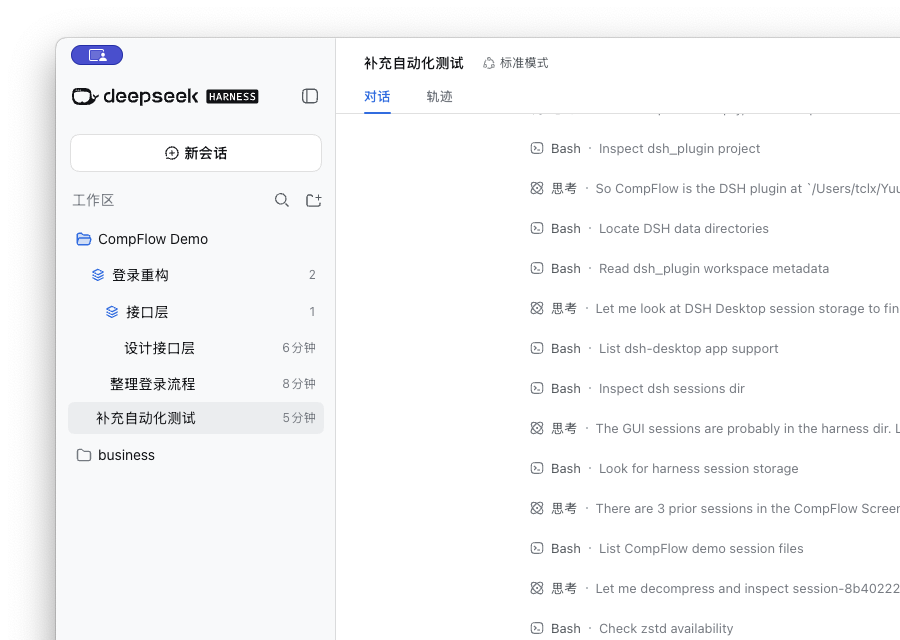
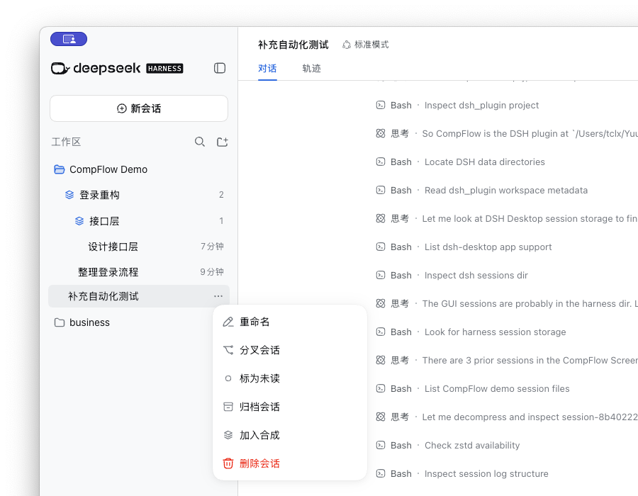

# CompFlow

CompFlow 是一个 DSH Desktop 会话管理插件。它把同一工作区里的多个会话收进可折叠的“合成”，让频繁分叉后的会话列表保持清爽。



## 功能

- 创建、重命名、折叠和嵌套合成
- 通过拖拽移动会话与合成
- 从会话菜单快速新建或加入同级合成
- 将会话移回工作区根目录
- 解散合成时保留全部会话
- 删除合成时确认并永久删除整个子树及其中会话



## 使用

在会话的三点菜单中选择“加入合成”，然后新建合成或选择当前层级已有的合成。也可以直接拖动会话和合成来调整结构

右键合成可以重命名、新建子合成、解散或删除。合成仅能管理同一工作区中的会话

## 安装

```sh
dsh plugin --profile web add github:SoyBeanMilkx/CompFlow
```

安装完成后重启 DSH Desktop。

## 开发

```sh
npm run build
npm test
```

开发时也可以从本地目录安装到 DSH Desktop 的 `web` profile：

```sh
dsh plugin --profile web add /path/to/CompFlow
```

首次安装或 Host 端代码更新后，可能需要完全重启 DSH Desktop。
